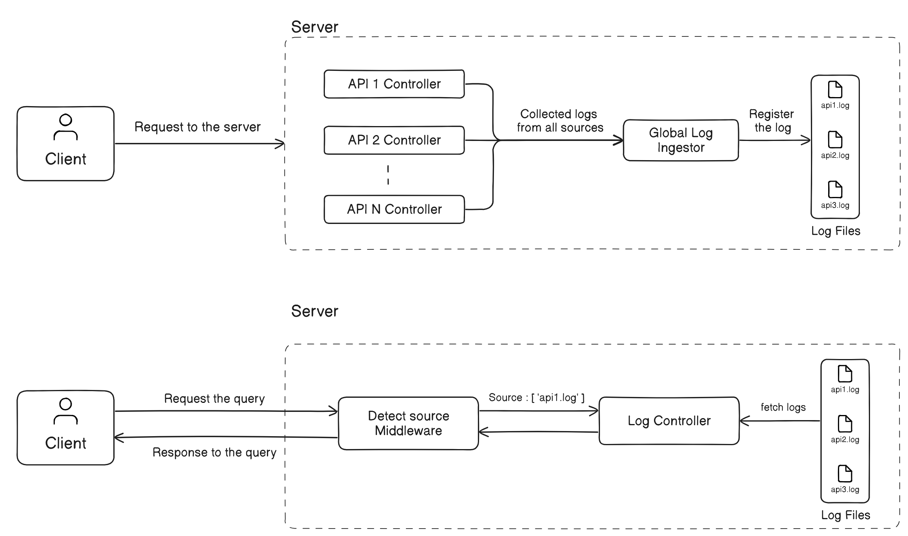
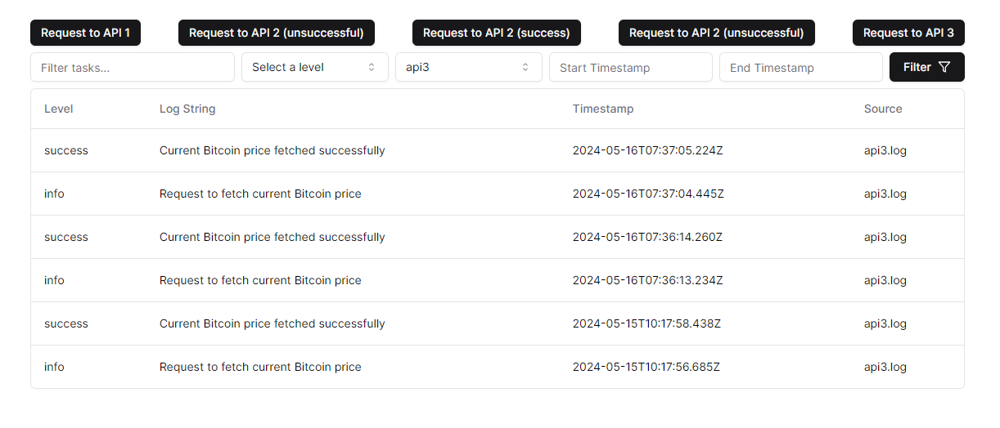

# Quality Log Control

## Objective

Build a problem solution that uses APIs with logs at different stages. These logs should be stored in some log files such as `log1.log`, `log2.log` etc files. You need to build a Query Interface also that traverses through these logs files and fetches logs based on timestamp, log string, source of the log, etc.

**Getting Started**

To embark on your e-learning API development journey, follow these steps:

1. **Clone the Repository:**

   ```bash
   git clone https://github.com/devendra-dantal04/Log-Ingestor-and-Quality-Log-Control
   cd Log-Ingestor-and-Quality-Log-Control
   ```

**For Server**

2. **Install Dependencies:**

   ```bash
   cd backend
   npm install
   ```

3. **Configure Environment Variables:**

   Rename `.env.example` to `.env` and populate it with the necessary environment variables according to the provided instructions or documentation. (if applicable).

4. **Start the Server:**
   Server run over PORT `5000` by default if not provided in env variables

   ```bash
   npm run start
   ```

**For Client**

2. **Install Dependencies:**

   ```bash
   cd client
   npm install
   ```

3. **Configure Environment Variables:**

   Rename `.env.example` to `.env` and populate it with the necessary environment variables according to the provided instructions or documentation. (if applicable).

4. **Start the Server:**

   ```bash
   npm run dev
   ```

## Features Implemented

### Log Ingestor:

**API Integration:**  
Integrated 3-4 APIs to capture logs at different stages of the application.
Log Formatting: Standardized the format for logging across all APIs, including a timestamp, log level, source, and log message.

**Logging Configuration:**  
Implemented a flexible configuration mechanism to set logging levels and file paths for each API, ensuring ease of management.

**Error Handling:**  
Implemented robust error handling to prevent disruptions in logging functionality.

### Query Interface:

**User Interface:** Developed a user-friendly Query Interface, allowing users to search logs efficiently.

**Filtering:** Implemented filtering options based on log level, log string, timestamp, and source metadata for precise log retrieval.

**Efficient Search:** Aimed for efficient and quick search results to enhance user experience.

### Advanced Features:

**Date Range Filter:** Implemented the ability to filter logs within specific date ranges.

**Regular Expressions:** Utilized regular expressions for advanced log string search at client end.

**Combining Filters:** Allowed users to combine multiple filters for more targeted searches.

# System Design / Architechture



## Output



## API Endpoints

**API Log Ingesting Routes:**

| Method | Endpoint                          | Description                   |
| ------ | --------------------------------- | ----------------------------- |
| POST   | `/api1/login`                     | API 1 Endpoint (Successful)   |
| POST   | `/api1/login?type=unsuccessful`   | API 1 Endpoint (Unsuccessful) |
| GET    | `/api2/repos?username={username}` | API 2 Endpoint                |
| GET    | `/api2/price`                     | API 3 Endpoint                |

**Query Interface Endpoints**

| Method | Endpoint                                                                                                                                           | Description                     |
| ------ | -------------------------------------------------------------------------------------------------------------------------------------------------- | ------------------------------- |
| GET    | `/logs?level=${filters.level}&q=${filters.logString}&source=${filters.source}&startTime=${filters.startTimestamp}&endTime=${filters.endTimestamp}` | Query Log Endpoint with Filters |

## Identified Issues

1. **Unoptimized Search:** The current search functionality may not be optimized for handling large volumes of logs efficiently. Consider implementing optimizations such as integrating Elasticsearch or other search engines. Additionally, leveraging databases like PostgreSQL to store logs and adding indexing can improve search query performance significantly.

2. **Manual Refresh for New Logs:** In the client-side interface, users have to manually refresh or refetch the page to view new logs. This can be inconvenient and inefficient, especially in real-time monitoring scenarios. Implementing websockets can provide a more seamless experience by automatically fetching and displaying new logs as they arrive.
